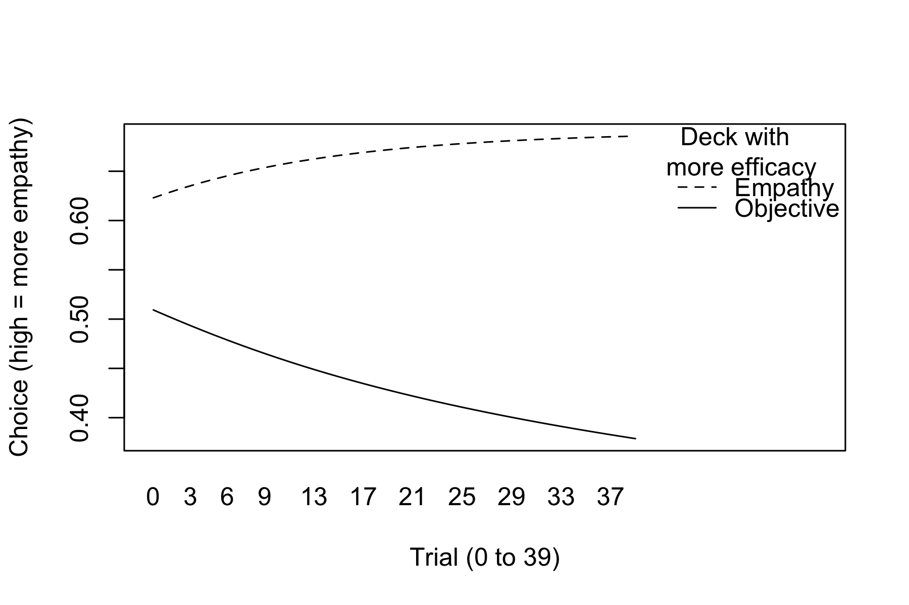

```{r setup, include=FALSE}
knitr::opts_chunk$set(echo = TRUE)

# Define a function to format the p-values
format_p <- function(p_value) {
  if (p_value < .001) {
    return("*p* < .001")
  } else {
    return(paste0("*p* = ", round(p_value, 3)))
  }
}

```

```{r packages, include=FALSE, echo = FALSE}
packages = c("psych","dplyr","tidyverse", "lme4")

## Now load or install&load all
package.check <- lapply(
  packages,
  FUN = function(x) {
    if (!require(x, character.only = TRUE)) {
      install.packages(x, dependencies = TRUE)
      library(x, character.only = TRUE)
    }
  }
)


```

```{r import_data, echo = FALSE}
url <- "https://raw.githubusercontent.com/jorowags/avila_crep_cameron/main/avila_cameron_data.csv"
initial_data <- read.csv(url)
data <- initial_data

```

```{r process_data, echo = FALSE}

# rename variables
names(data)[names(data) == "Q004_03"] <- "age"
## XXX rename other variables

# remove participants who did not finish study
data <- subset(data, data$LASTPAGE > 85)

# remove minors
data <- subset(data, data$age > 17)

# remove cases with "test" in gender
data <- subset(data, !grepl("Test", age, ignore.case = TRUE))

# Initialize new variables
for (i in 1:40) {
  new_var <- paste0("T", sprintf("%03d", i))
  data[[new_var]] <- NA
}

# Populate the new variables with the choices
for (row in 1:nrow(data)) {
  for (i in 1:40) {
    # Get the trial column name and stimulus number
    trial_col <- paste0("R001x", sprintf("%02d", i))
    stimulus_num <- data[row, trial_col]
    
    # Get the choice column name
    choice_col <- paste0("C", sprintf("%03d", stimulus_num))
    
    # Get the new variable name
    new_var <- paste0("T", sprintf("%03d", i))
    
    # Populate the new variable with the choice
    data[row, new_var] <- data[row, choice_col]
  }
}

```

# Introduction
Replicating a study gets a bad rap in science as many see this process as repeating a study’s procedures exactly, ignoring the benefits of this process. Replication is important to science as it establishes credibility for their findings with new data as evidence (Nosek & Errington, 2020). Not only can researchers see if the findings reoccur, following the same methodology, but they can also explore additional areas. Researchers believe that replication is just being redundant or stating the obvious if you happen to have the same findings, but in reality, these findings are most significant because they strengthen the credibility of existing findings. Additionally, replication of previous findings improves generalizability, even under conditions that will differ from the original study (Nosek & Errington, 2020). 

## Background
### Replication
Replication is often utilized within research, reproducing or repeating a previous study's methods and procedures. This approach is used to see if the previous findings may be generalizable. This helps to prove reliability and validity of previous research. It’s important to practice replication in order to see if the original findings were a one-time result, or if in-fact this phenomena is consistent and generalizable. Replication does not always result in similar findings due to different conditions, such as different samples, settings, etc. Of course, a sample is never able to be exactly replicated, so findings consistent among other samples within these replications again helps to see if these findings are reliable and valid. Lastly, it is not a bad thing for a replicated study to not result in similar findings. Replication also allows for researchers to discover new or additional findings. Additionally, things that are wrong in the previous research may be found. Replication is an opportunity to identify any errors or limitations in the previous research. 

Replication plays a significant role in research. Although novel findings are significant to address, the ability to replicate another researcher’s findings only helps the credibility of said findings. Since so many factors could have made the findings a one-time event, it's important to see if these findings could be replicated in another environment. Additionally, it’s important to see if further significant findings could be explored through additional measures added or if better methodology could be utilized. Despite the benefits of replication, oftentimes researchers don’t want to be involved in replication studies since it is highly tempting to be involved in novel research. Also, people are more inclined to participate in novel research since they want to discover new findings, or perhaps don’t want to go through all the work of the experiment to get expected results.

### The Replication Crisis
An ongoing issue within the replication of studies is the “replication crisis”. The replication crisis remains a prominent issue as much of psychology and its findings may not be reliable or accurate. When attempts are made to replicate previous findings, these studies may fail to reproduce the results of the previous research. This can lead to concern or doubt about the validity of the previous studies. The promotion of replication remains important to addressing the replication crisis by contributing to the reliability of previous findings. The replication crisis is rooted by many problems including data fabrication, data misrepresentation, publication bias or self-censoring, and post hoc hypothesizing. Data fabrication in research can occur when researchers alter their data to support their predictions, making these outcomes more difficult to replicate. Researchers could have also misrepresented their data by cherry-picking results or omitting contradictory data.

Additionally, publication bias may affect replication since researchers may show only positive or significant results, disregarding nonsignificant or negative findings that may come up in the replication as well. Lastly, many researchers fall victim to post hoc hypothesizing, or modifying their hypotheses after analyzing the data, which makes it difficult for previous findings to be replicated. Any of these practices affects the reliability of research and can impede future replications. 

### Collaborative Replication 
CREP, otherwise known as the Collaborative Replication and Education Project, allows for undergraduate students and the corresponding faculty to participate in direct replications of selected studies (Wagge et al., 2019). These replications prove to be educational to students as they are taught good scientific practices through performing direct replications on high quality cited articles, while applying their research skills when using open science methods. CREP proves to be an excellent tool for promoting replication since data from direct replications help establish credibility for the discipline. It also benefits students as they are receiving training in beneficial research practices. CREP is inclusive to those with limited knowledge or expertise, therefore, students aren’t required to have extensive knowledge of a literature or research design to participate in these replications; instead they gain this knowledge along the way. 

CREP studies are selected for crowdsourced direct replications by the CREP team. They are chosen from samples of the most highly cited papers from majorly cited journals. These articles are curated to be presented to faculty or research teams that will facilitate these replications with the help of their students or fellow researchers. It is also important that these research processes are plausible to be replicated in an institutional or lab setting that students can partake in the replication. To complete CREP projects, the student is first introduced to CREP by a faculty instructor at their institution. They work together to coordinate specific tasks or assignments and meet deadlines during the replication process. Although student groups typically conduct direct replications of the selected studies, it is possible to include additional measures or conditions that may be investigated as they test their own exploratory hypotheses. This replication process allows students to gain skills in following research methods and utilizing critical evaluation skills to investigate scientific claims. 

When students become involved in a CREP project, faculty often instruct them on their assigned duties and guide them through each step of the replication process. Students can first get involved by reading the empirical paper of the selected study. After this, students and their faculty mentors can decide if their methods will be a direct replication of the study, or if they wish to include any extension hypotheses. Students can also get practice at filling out an IRB application that will be submitted and reviewed to the CREP team. Once approved, students will then be able to collect and analyze data, later submitting the results for final review by the CREP team. Students may choose to complete a final project such as a poster or presentation to share their findings, even if not consistent with the original study. 

CREP can lead students to publication of their work, compared to other teaching models that are much lengthier to approve every step of a student’s experimental design or creating their own hypotheses or collecting data, with no guidance towards sharing their research. CREP helps students get first-hand experience with scientific dissemination since students become the primary researchers that can not only participate in the replication and collecting data, but also in presenting or sharing their results in presentations or even at conferences. Open Science Framework (OSF) is also a highly beneficial tool for students to practice sharing their data to other researchers. Students can also learn to not only collect data and test hypotheses, but also how to write up and present this data, participating in the authorship process. These replications can be more beneficial to students since it may be more likely to result in a publication for the student than other research models. Even if the direct replications come up with unexpected results, it is still worth sharing and viable for a student to be published. The process can also be completed faster than other research models since they are designed and selected to be completed with a typical semester. CREP is designed to be a more efficient and productive method of promoting and applying research practices for students and other researchers, especially those who could gain research skills from it. 

## Cameron et al.’s Study
In Cameron et al.'s (2019) study on empathy, they found that participants were more aversive to, or avoidant of empathy when they found it to be effortful, or if perceived cognitive costs of empathy were present. This research is important to explore further as empathy is a good thing for individuals to have, but often they fail to utilize it, or have it in many situations. Previous research only focused on material and emotional costs of empathy, and this study chose to expand on this with the examination of how cognitively tasking individuals view empathy and how this may affect their desire to empathize. To explore this, they had participants recruited on MTurk complete the Empathy Selection Task, having participants choose from binary choices and selecting situations after viewing a photo of a child refugee. Participants viewed different decks with various instructions on their experiences with empathy. Participants were tasked with choosing between a “DESCRIBE” and a “FEEL” deck displayed on their screen. The depiction of the child refugee is then shown with the corresponding prompt for their selected deck. Participants completed 40 trials to assess what effect perceived cognitive costs may have on their desire to empathize, responding accordingly to their selected deck each time. This study found that individuals perceived the empathy related deck as more effortful and aversive, demonstrating that empathy efficacy increased a participant's likelihood of empathizing in the situation. Participants displayed more empathy avoidance when there was perceived cognitive costs. An individual’s empathy increases when they interpret the situation as less cognitively costly.

## The Present Study
Following the procedures of Cameron et al.’s study, we hypothesize that the present study will replicate their previous findings. We expect that participants will demonstrate a preference for the empathy deck when completing the trials of the Empathy Selection Task. 

### Extension Hypotheses
As an extension hypothesis, our class decided to test whether self-reported fatigue and deck choice were associated. Specifically, we believed that participants who chose empathy more would express higher levels of mental -- but not physical -- fatigue after the study was complete.

# Method
```{r descriptives, echo = FALSE, include = FALSE}

# N
## Calculate number of cases in initial data
n_initial <- length(unique(initial_data$CASE[initial_data$CASE != "NANA"]))
n_final <- length(unique(data$CASE[data$CASE != "NANA"]))
n_exclusions <- as.numeric(n_initial) - as.numeric(n_final)

## Calculate number of cases in final data

# Age M and SD
## Clean up age variable
data$age <- gsub("\\D", "", data$age)
age_m <- sprintf("%.2f", mean(as.numeric(data$age)), 2)
age_sd <- sprintf("%.2f", sd(as.numeric(data$age)), 2)

# gender
## Clean up variable
names(data)[names(data) == "Q004_01"] <- "gender"
data$gender <- gsub("alpha male","male", data$gender)
data$gender <- gsub("I am a damn male","male", data$gender)
data$gender <- gsub("MALE","male", data$gender)
data$gender <- gsub("Male","male", data$gender)
data$gender <- gsub("Straight male","male", data$gender)
data$gender <- gsub("male ","male", data$gender)
data$gender <- gsub("Female","female", data$gender)

## Get gender percentages
female_percentage <- sprintf("%.2f", prop.table(table(data$gender))["female"] * 100, 2)
male_percentage <- sprintf("%.2f", prop.table(table(data$gender))["male"] * 100, 2)
nb_percentage <- sprintf("%.2f", prop.table(table(data$gender))["non-binary"] * 100, 2)

# Race/ethnicity
## Clean up variable
names(data)[names(data) == "Q004_02"] <- "race"
data$race <- gsub("AA/Caucasian","Multiracial", data$race)
data$race <- gsub("Hispanic/latino","Hispanic", data$race)
data$race <- gsub("White/Caucasian ","White", data$race)
data$race <- gsub("White/Hispanic","Multiracial", data$race)
data$race <- gsub("African American ", "Black", data$race)
data$race <- gsub("Black American ", "Black", data$race)
data$race <- gsub("African American", "Black", data$race)
data$race <- gsub("Caucasian ", "White", data$race)
data$race <- gsub("white ", "White", data$race)
data$race <- gsub("caucasian", "White", data$race)
data$race <- gsub("Caucasian", "White", data$race)
data$race <- gsub("white", "White", data$race)
data$race <- gsub("hispanic", "Hispanic", data$race)
data$race <- gsub("Indian ", "Indian", data$race)
data$race <- gsub("Native Indian", "Indigenous", data$race)
data$race <- gsub("None ", "None Reported", data$race)

## Get race percentages
white_percentage <- sprintf("%.2f", prop.table(table(data$race))["White"] * 100, 2)
black_percentage <- sprintf("%.2f", prop.table(table(data$race))["Black"] * 100, 2)
hispanic_percentage <- sprintf("%.2f", prop.table(table(data$race))["Hispanic"] * 100, 2)
indian_percentage <- sprintf("%.2f", prop.table(table(data$race))["Indian"] * 100, 2)
indigenous_percentage <- sprintf("%.2f", prop.table(table(data$race))["Indigenous"] * 100, 2)
multiracial_percentage <- sprintf("%.2f", prop.table(table(data$race))["Multiracial"] * 100, 2)
none_percentage <- sprintf("%.2f", prop.table(table(data$race))["None Reported"] * 100, 2)

```

## Participants
For this replication, participants were recruited from an undergraduate research pool at Avila University, using convenience sampling. Additionally, this study was advertised on social media and shared by researchers on this project. Our initial N was `r n_initial`. The present study had a total of `r n_final` participants, with `r n_exclusions` participants excluded from consideration when analyzing our data because of incomplete or test data. Criteria for exclusion from this study was determined based on if the individual failed to complete the entire survey, and `r (n_exclusions - 1)` participants were removed for that reason while one test case participant was removed. 

In order to participate in this study, participants had to be at least 18 years of age (*M* = `r age_m`, *SD* = `r age_sd`), with participants ranging between ages `r min(data$age)` and `r max(data$age)`. The majority of participants (`r female_percentage`%) identified as female, in addition to `r male_percentage`% identifying as male, and `r nb_percentage`% identifying as non-binary. Demographics were also collected for participants’ race/ethnicity, finding that the majority of participants (`r white_percentage`%) identified as white. Additionally, `r black_percentage`% of participants were Black, `r hispanic_percentage`% were Hispanic/Latino, `r indian_percentage`% were Indian, `r indigenous_percentage`% were Indigenous, and `r multiracial_percentage`% were multiracial (responded with multiple racial/ethnic identities). 

## Procedures and Materials 
Participants completed this online study on SoSci Survey. Participants were told beforehand that they should be able to complete the survey within 30 minutes. After completing the informed consent form, participants were instructed that they would complete a series of trials, seeing two decks of cards: the red “DESCRIBE” desk on the left, and the blue “FEEL” deck on the right. Participants were asked to choose between these decks. Once a deck has been chosen, an image of a person is revealed. Depending on the deck chosen by the participant. they were given one of two possible sets of instructions. 

When a participant selects from the “DESCRIBE” deck, the participant was told to look at the image objectively, focusing on the external features and appearances of the person in the image. For these trials, participants were asked to type one sentence describing the age and gender of the person in the image. When a participant selects from the “FEEL” deck, the participant was told to look at the image empathetically, focusing on the internal feelings and experiences of the person in the image. For these trials, participants were asked to type one sentence describing the feelings and experiences of the person in the image. Participants were able to independently choose from either deck on any trial, and were free to choose from each deck at any time. Participants were not required to choose any deck for a specific amount of trials, and could in fact choose to favor a deck, completing more trials on it than the other deck. 

After completing the series of trials, participants were tasked to complete a series of questions with open-ended responses, assessing their experience with the Empathy Selection Task. The questions asked participants to share how they chose between decks, or if they had any preferences, in addition to if they noticed any differences between the decks. Participants were then asked to answer questions regarding both the “DESCRIBE” and “FEEL” deck. In regard to both decks, participants answered questions using a 5-point Likert scale, ranging from “Very Low” to “Very High”. Some questions included “How mentally demanding was this deck?”, and “How successful were you in accomplishing what you were asked to do in this deck?”. Following this, participants were asked to respond to demographic questions about their gender identity, racial/ethnic identity, and age. Additionally, participants were asked to complete a few multiple-choice questions about their political orientation (ranging from extremely liberal to extremely conservative, as well as how religious they are (ranging from not at all religious to extremely religious). 

Next, participants looked at an image of a stack of coins and were told to think of it as representing where people stand in the United States. They were then asked, “Where would you place yourself on this stack of coins?” by moving the “X” on the screen to where they think they stand. Finally, to gauge participant fatigue, they completed the Multidimensional Fatigue Inventory (Smets et al., 1995), a 20-item survey that assesses self-reported fatigue for five different categories: mental, physical, general, reduced motivation, and reduced activity. Participants answered a series of questions using a 7-point Likert-type scale, ranging from “yes, that is true” to “no, that is not true”. 

Results collected on SoSci were downloaded, evaluated, then analyzed once the desired number of participants had completed the study. Participant responses were reviewed to ensure that participants responded appropriately to the chosen deck. Responses were coded by graduate student researchers involved in this replication study, under the supervision of their faculty mentor. All responses were reviewed and flagged if a participant didn’t respond appropriately to their selected deck (e.g., failing to describe how the child looked for the “DESCRIBE” deck; failing to describe how the child felt for the “FEEL” deck). After reviewing all the data, 4.32% of participant responses for the “DESCRIBE” or “FEEL” trials were flagged by the coders, but remained included in the data analyzed.

```{r replication_analyses, echo = FALSE}
# take mean of deck choices – numbers closer to 2 indicate more “Feel”, closer to 1 indicate more “Describe”, subtract 1 to get numbers similar to theirs
# Calculate and store the choice_index
data$choice_index <- rowMeans(data[, paste0("C", sprintf("%03d", 1:40))]) - 1

# Calculate the overall mean of choice_index for all participants
mean_choice_index <- mean(data$choice_index, na.rm = TRUE)

#calculate NASA
## RedNASA - describe (objective) deck
### Rename variables
names(data)[names(data) == "Q002_01"] <- "RedNASA_demanding"
names(data)[names(data) == "Q002_02"] <- "RedNASA_hard_work"
names(data)[names(data) == "Q002_03"] <- "RedNASA_aversion"
names(data)[names(data) == "Q002_04"] <- "RedNASA_efficacy"

### Replace -9 with "NA"
data$RedNASA_demanding[data$RedNASA_demanding == "-9"] <- NA
data$RedNASA_hard_work[data$RedNASA_hard_work == "-9"] <- NA
data$RedNASA_aversion[data$RedNASA_aversion == "-9"] <- NA
data$RedNASA_efficacy[data$RedNASA_efficacy == "-9"] <- NA

### Add variables for "subscales"
data$RedNASA_effort <- (data$RedNASA_demanding+data$RedNASA_hard_work)/2

## BlueNASA - feel (empathy) deck
### Rename variables
names(data)[names(data) == "Q003_01"] <- "BlueNASA_demanding"
names(data)[names(data) == "Q003_02"] <- "BlueNASA_hard_work"
names(data)[names(data) == "Q003_03"] <- "BlueNASA_aversion"
names(data)[names(data) == "Q003_04"] <- "BlueNASA_efficacy"
### Replace -9 with "NA"
data$BlueNASA_demanding[data$BlueNASA_demanding == "-9"] <- NA
data$BlueNASA_hard_work[data$BlueNASA_hard_work == "-9"] <- NA
data$BlueNASA_aversion[data$BlueNASA_aversion == "-9"] <- NA
data$BlueNASA_efficacy[data$BlueNASA_efficacy == "-9"] <- NA
### Add variables for "subscales"
data$BlueNASA_effort <- (data$BlueNASA_demanding+data$BlueNASA_hard_work)/2

# calculate MFI. Higher scores = more fatigue
# Rename variables
# Create vector of old and new names
old_names <- paste0("EX01_", sprintf("%02d", 1:20))
new_names <- paste0("MFI_", sprintf("%02d", 1:20))

# Rename the columns
names(data)[names(data) %in% old_names] <- new_names

## Replace -9 with "NA" on all variables
data <- data %>%
  mutate_at(vars(paste0("MFI_", sprintf("%02d", 1:20))), 
            ~replace(., . == -9, NA))


#3.	Same as #2, but for Aversive
#4.	Same as #3, but for Efficacy
#5.	Correlation: deck selection and effodiff
#6.	Correlation: deck selection and affdiff
#7.	Correlation: deck selection and NASA effidiff

# Time course analysis -- see https://osf.io/w8czf


```

# Results

```{r one-sample, include = FALSE, echo = FALSE}

#	One-sample t-test against .5 for deck selection 
deck_t_result <- t.test(data$choice_index, mu = 0.5)
# Extract the necessary values for reporting
one_t_value <- round(deck_t_result$statistic, 2)
one_df <- round(deck_t_result$parameter, 0)
one_p_value <- round(deck_t_result$p.value, 3)
one_mean <- round(deck_t_result$estimate, 2)
one_ci_low <- round(deck_t_result$conf.int[1], 2)
one_ci_high <- round(deck_t_result$conf.int[2], 2)

```

Upon completion of reviewing all participant responses, in order to assess participant preference between the two decks, we employed the following statistical analyses. We conducted a one-sample t-test against a value of .5, in order to determine whether participants tended to prefer one deck over the other (empathy = 1, neutral/describe = 0). In the original study, they found significant differences in the mean empathy choice when compared to .5, *t*(55) = -4.70, *p* < .001. These results indicated that more participants favored the neutral deck (*M* = .33, *SD* = .27). In the present study, we were unable to replicate this effect, with our findings showing no significant differences, *t*(`r one_df`) = `r one_t_value`, `r format_p(one_p_value)`. Our analysis indicated that participants did not exhibit a preference for one deck over the other (*M* = `r one_mean`, *SD* = `r round(sd(data$choice_index), 2)`). 

In the original study, after conducting a meta-analysis over 11 different studies they found that the empathy deck, when compared to the objective, was characterized as more effortful, less efficacious, and more aversive. These differences across all studies examined were statistically significant (*p* < .001).

```{r effort_tests, include = FALSE, echo = FALSE}
#	One-sample t-test: EffortDiff (empathy minus objective) deck selection -> NASA effort, test against 0

## Create effortdiff score by calculating objective NASA - empathy NASA. Values below 0 indicate that empathy was more effortful.
data$effortdiff <- data$RedNASA_effort - data$BlueNASA_effort

# Conduct one-sample t-test
effort_t_result <- t.test(data$effortdiff, mu = 0)

# Extract the necessary values for reporting
effortdiff_t_value <- round(effort_t_result$statistic, 2)
effortdiff_df <- round(effort_t_result$parameter, 0)
effortdiff_p_value <- round(effort_t_result$p.value, 3)
effortdiff_mean <- round(effort_t_result$estimate, 2)
effortdiff_ci_low <- round(effort_t_result$conf.int[1], 2)
effortdiff_ci_high <- round(effort_t_result$conf.int[2], 2)

### Effect size
# Calculate Cohen's d
effortdiff_cohens_d <- round(mean(data$effortdiff) / sd(data$effortdiff), 2)

```

In the present study, we conducted similar one-sample t-tests using our data collected. 

### NASA Scores

#### Effort
To calculate the effort score, we subtracted effort scores for the blue deck ("feel") from effort scores for the red deck ("describe"). Numbers above 0 indicate greater effort for the red (describe/objective) deck, while numbers below 0 indicate greater effort for the blue (empathy) deck. Scores for effort were significantly below 0 (*M* = `r effortdiff_mean`, *SD* = `r round(sd(data$effortdiff),2)`), indicating that participants perceived the empathy deck to require more effort (*t*(`r effortdiff_df`) = `r effortdiff_t_value`, `r format_p(effortdiff_p_value)`, *d* = `r effortdiff_cohens_d`).

```{r aversiveness_tests, include = FALSE, echo = FALSE}
#	One-sample t-test: aversiveness (empathy minus objective) -> NASA aversion, test against 0

## Create aversion score by calculating aversiveness scores for red minus blue decks. Values below 0 indicate that empathy was more aversive
data$aversion <- data$RedNASA_aversion - data$BlueNASA_aversion

# Conduct one-sample t-test
aversion_t_result <- t.test(data$aversion, mu = 0)

# Extract the necessary values for reporting
aversion_t_value <- round(aversion_t_result$statistic, 2)
aversion_df <- round(aversion_t_result$parameter, 0)
aversion_p_value <- round(aversion_t_result$p.value, 3)
aversion_mean <- round(aversion_t_result$estimate, 2)
aversion_ci_low <- round(aversion_t_result$conf.int[1], 2)
aversion_ci_high <- round(aversion_t_result$conf.int[2], 2)

### Effect size
# Calculate Cohen's d
aversion_cohens_d <- round(mean(data$aversion) / sd(data$aversion), 2)

```

#### Aversiveness
We computed aversiveness scores in the same manner (subtracting blue scores from red scores, so that numbers lower than 0 indicate more aversiveness for the blue empathy deck). Participants did rate the blue deck as more aversive than the red deck (*M* = `r aversion_mean`, *SD* = `r round(sd(data$aversion), 2)`), *t*(`r aversion_df`) = `r aversion_t_value`, `r format_p(aversion_p_value)`, *d* = `r aversion_cohens_d`. 

```{r efficacy_tests, include = FALSE, echo = FALSE}
#	One-sample t-test: efficacy (empathy minus objective) -> NASA efficacy, test against 0

## Create efficacy score by calculating red minus blue decks. Values above 0 indicate that the red deck (describe) was more efficacious
data$efficacy <- data$RedNASA_efficacy - data$BlueNASA_efficacy

# Conduct one-sample t-test
efficacy_t_result <- t.test(data$efficacy, mu = 0)

# Extract the necessary values for reporting
efficacy_t_value <- round(efficacy_t_result$statistic, 2)
efficacy_df <- round(efficacy_t_result$parameter, 0)
efficacy_p_value <- round(efficacy_t_result$p.value, 3)
efficacy_mean <- round(efficacy_t_result$estimate, 2)
efficacy_ci_low <- round(efficacy_t_result$conf.int[1], 2)
efficacy_ci_high <- round(efficacy_t_result$conf.int[2], 2)

### Effect size
# Calculate Cohen's d
efficacy_cohens_d <- round(mean(data$efficacy) / sd(data$efficacy), 2)

```

#### Efficacy
Similarly, we computed efficacy scores and found that participants felt the red (objective) deck was more efficacious than the blue (empathy) deck (*M* = `r efficacy_mean`, *SD* = `r round(sd(data$efficacy),2)`), *t*(`r efficacy_df`) = `r efficacy_t_value`, `r format_p(efficacy_p_value)`, *d* = `r efficacy_cohens_d`.

#### Deck selection and NASA subscales

```{r decks_subscales, include = FALSE, echo = FALSE}

choice_effort <- corr.test(data$choice_index, data$effortdiff)
print(choice_effort, short = FALSE)

choice_effort_r_value <- round(choice_effort$r, 2)
choice_effort_df <- choice_effort$n - 2
choice_effort_p_value <- round(choice_effort$p, 3)
choice_effort_ci_lower <- round(choice_effort$ci$lower, 2)
choice_effort_ci_upper <- round(choice_effort$ci$upper, 2)

choice_aversion <- corr.test(data$choice_index, data$aversion)
print(choice_aversion, short = FALSE)

choice_aversion_r_value <- round(choice_aversion$r, 2)
choice_aversion_df <- choice_aversion$n - 2
choice_aversion_p_value <- round(choice_aversion$p, 3)
choice_aversion_ci_lower <- round(choice_aversion$ci$lower, 2)
choice_aversion_ci_upper <- round(choice_aversion$ci$upper, 2)

choice_efficacy <- corr.test(data$choice_index, data$efficacy)
print(choice_efficacy, short = FALSE)

#scatterplot
library(ggplot2)
# Basic scatter plot
scatterplot <- ggplot(data, aes(x=efficacy, y=choice_index)) + 
  geom_point(size=1.5, shape=19) +
  geom_point()+
  geom_smooth(method=lm, se=FALSE, color="black")+
  labs(title="Deck choice frequency by perceived efficacy",
       x="Efficacy (perceived efficacy of objective deck)", y = "Choice Index (rate of choosing empathy deck)")
ggsave("scatterplot.png", plot = scatterplot, width = 6, height = 4, dpi = 300)


choice_efficacy_r_value <- round(choice_efficacy$r, 2)
choice_efficacy_df <- choice_efficacy$n - 2
choice_efficacy_p_value <- round(choice_efficacy$p, 8)
choice_efficacy_ci_lower <- round(choice_efficacy$ci$lower, 2)
choice_efficacy_ci_upper <- round(choice_efficacy$ci$upper, 2)

```

Additionally, the original study also conducted a meta-analysis and found negative correlations between the selection of the empathy deck and ratings of effort and aversiveness associated with that deck. Again, the differences were all statistically significant (*p* < .001). In the present study, we conducted a Pearson’s r correlation analysis to investigate if similar associations exist in our dataset. We found no significant correlation between deck choice (empathy selection) and perceived effort for each deck (*r* = `r choice_effort_r_value`, `r format_p(choice_effort_p_value)`) or perceived aversiveness (*r* = `r choice_aversion_r_value`, `r format_p(choice_aversion_p_value)`). However, a statistically significant negative correlation was found between deck choice and efficacy (*r* = `r choice_efficacy_r_value`, `r format_p(choice_efficacy_p_value)`), indicating that participants who tended to choose the empathy deck more often than other participants also tended to perceive that deck as more efficacious (see Figure 1). 


```{r time_course, echo=FALSE, include = FALSE}
# Center means for effortdiff, aversion, efficacy, choice
# Subtract the mean from each observation to center the variable
data$effortdiff_centered <- data$effortdiff - effortdiff_mean
data$efficacy_centered <- data$efficacy - mean(data$efficacy)
data$aversion_centered <- data$aversion - aversion_mean

# Create a tall subset with time course choices
tall_data <- data %>%
  pivot_longer(
    cols = c("T001", "T002", "T003", "T004", "T005", "T006", "T007", "T008", "T009", "T010",
             "T011", "T012", "T013", "T014", "T015", "T016", "T017", "T018", "T019", "T020",
             "T021", "T022", "T023", "T024", "T025", "T026", "T027", "T028", "T029", "T030",
             "T031", "T032", "T033", "T034", "T035", "T036", "T037", "T038", "T039", "T040"),    
    names_to = "Trial", 
    values_to = "Value" 
  )

new_values <- setNames(as.character(1:40), paste0("T", sprintf("%03d", 1:40)))

# Recode values in the column
tall_data$Trial <- as.numeric(recode(tall_data$Trial, !!! new_values))

# Examine interactions between effortdiff, aversion, efficacy, and time course 

# Generalized linear mixed model examining choice (empathy =1) over time
# Includes random intercept and random slope for time, autoregressive covariance parameter
# Time centered to start at 0 (0 - 39)
tall_data$Trial_centered <- tall_data$Trial - 1

# Value set to 0 and 1
tall_data$Value_centered <- tall_data$Value - 1


model1 <- glmer(Value_centered ~ Trial_centered + (Trial_centered | CASE), data = tall_data, family = binomial(link = "logit"))


# Examining interaction of Time x mean-centered NASA effort ratings (empathy deck - objective deck)
model2 <- glmer(Value_centered ~ Trial_centered * effortdiff_centered + (Trial_centered | CASE), data = tall_data, family = binomial(link = "logit"))

# Examining interaction of Time x mean-centered NASA efficacy ratings
model3 <- glmer(Value_centered ~ Trial_centered * efficacy_centered + (Trial_centered | CASE), 
                data = tall_data, 
                family = binomial(link = "logit"), 
                control = glmerControl(optimizer = "bobyqa", optCtrl = list(maxfun = 1e5)))

# Examining interaction of Time x mean-centered NASA aversion ratings
model4 <- glmer(Value_centered ~ Trial_centered * aversion_centered + (Trial_centered | CASE), data = tall_data, family = binomial(link = "logit"))

# Print summary of models
summary(model1)
beta_Trial_centered <- fixef(model1)["Trial_centered"]
pr_value_Trial_centered <- round(summary(model1)$coefficients["Trial_centered", "Pr(>|z|)"], 2)

summary(model2)
beta_interaction_effortdiff <- fixef(model2)["Trial_centered:effortdiff_centered"]
pr_value_interaction_effortdiff <- round(summary(model2)$coefficients["Trial_centered:effortdiff_centered", "Pr(>|z|)"], 2)

summary(model3)
beta_interaction_efficacy <- fixef(model3)["Trial_centered:efficacy_centered"]
pr_value_interaction_efficacy <- round(summary(model3)$coefficients["Trial_centered:efficacy_centered", "Pr(>|z|)"], 2)
pr_value_interaction_efficacy <- ifelse(pr_value_interaction_efficacy == 0, "< .001", pr_value_interaction_efficacy)


summary(model4)
beta_interaction_aversion <- fixef(model4)["Trial_centered:aversion_centered"]
pr_value_interaction_aversion <- round(summary(model4)$coefficients["Trial_centered:aversion_centered", "Pr(>|z|)"], 2)


```
### Time Course Interactions

In the original paper, the authors examined whether there was an interactive effect on deck selection between time course (early versus late trials) and aversiveness, efficacy, and effort. We found no significant main effects of time ($\beta$ = `r round(beta_Trial_centered, 2)`, *p* = `r pr_value_Trial_centered`) or interactions between time and effort ($\beta$ = `r round(beta_interaction_effortdiff, 2)`, *p* = `r pr_value_interaction_effortdiff`) or time and aversiveness ($\beta$ = `r round(beta_interaction_aversion, 2)`, *p* = `r pr_value_interaction_aversion`). However, we did find a significant interaction between time and efficacy, such that empathy deck selection appeared to decrease over time for participants who found the empathy deck less efficacious, and increase over time for participants who found the empathy deck more efficacious ($\beta$ = `r round(beta_interaction_efficacy, 2)`, *p* = `r pr_value_interaction_efficacy`). This pattern is demonstrated in Figure 2:




```{r time_plots, echo = FALSE, include=FALSE}
# Visualization of aggregated choices across participants over time
time_plot <- ggplot(tall_data, aes(x = Trial_centered, fill = as.factor(Value_centered))) +
  geom_bar(position = "fill") +
  labs(title = "Choices Over Time",
       x = "Trial Centered", y = "Proportion", fill = "Deck Choice") +
  scale_fill_manual(values = c("red", "blue"), labels = c("Objective (Describe)", "Empathy (Feel)")) +
  theme_minimal()
ggsave("time_plot.png", plot = time_plot, width = 6, height = 4, dpi = 300)
show(time_plot)

# Choices over time by participant
# Obtain the predicted probabilities from the model
tall_data$Predicted <- predict(model1, type = "response")

# Create a plot of the predicted probabilities
participant_time <- ggplot(tall_data, aes(x = Trial_centered, y = Predicted, group = CASE, color = as.factor(CASE))) +
  geom_line() +
  labs(title = "Changes in Response Over Time by CASE",
       x = "Trial Centered", y = "Predicted Probability") +
  theme_minimal() +
  guides(color = FALSE)

ggsave("participant_time.png", plot = participant_time, width = 6, height = 4, dpi = 300)
show(participant_time)

#efficacy/time interaction
# Convert efficacy_centered to a factor with 3 levels
tall_data$efficacy_levels <- cut(tall_data$efficacy_centered, breaks = 2, labels = c("Empathy", "Objective"))

# Create an interaction plot with 3 levels of efficacy
interaction_efficacy <- interaction.plot(tall_data$Trial_centered, tall_data$efficacy_levels, tall_data$Predicted,
                 xlab = "Trial (0 to 39)", ylab = "Choice (high = more empathy)",
                 trace.label = "Deck with\n more efficacy", legend = TRUE)
dev.print(png, file = "interaction_plot.png", width = 6, height = 4, units = "in", res = 300)


```


## Extension Hypotheses
```{r extension_hypotheses, echo = FALSE, include = FALSE}
## Reverse code 01, 03, 04, 06, 07, 08, 11, 12, 15, 20
data$MFI_01_R <- 8 - data$MFI_01
data$MFI_03_R <- 8 - data$MFI_03
data$MFI_04_R <- 8 - data$MFI_04
data$MFI_06_R <- 8 - data$MFI_06
data$MFI_07_R <- 8 - data$MFI_07
data$MFI_08_R <- 8 - data$MFI_08
data$MFI_11_R <- 8 - data$MFI_11
data$MFI_12_R <- 8 - data$MFI_12
data$MFI_15_R <- 8 - data$MFI_15
data$MFI_20_R <- 8 - data$MFI_20

## Calculate Subscales
### generalfatigue (items 1R, 5, 12R, 16)
data$MFI_general = data$MFI_01_R + data$MFI_05 + data$MFI_12_R + data$MFI_16
#### general fatigue alpha
general_subscale <- data[, c("MFI_01_R", "MFI_05", "MFI_12_R", "MFI_16")]
##### Compute Cronbach's alpha
psych::alpha(general_subscale)

### mental fatigue (items 7R, 11R, 13, 19)
data$MFI_mental = data$MFI_07_R + data$MFI_11_R + data$MFI_13 + data$MFI_19
#### mental fatigue alpha
mental_subscale <- data[, c("MFI_07_R", "MFI_11_R", "MFI_13", "MFI_19")]
##### Compute Cronbach's alpha
psych::alpha(mental_subscale)

### physical fatigue (items 2, 8R, 14, 20R)
data$MFI_physical = data$MFI_02 + data$MFI_08_R + data$MFI_14 + data$MFI_20_R
#### general fatigue alpha
physical_subscale <- data[, c("MFI_02", "MFI_08_R", "MFI_14", "MFI_20_R")]
##### Compute Cronbach's alpha
psych::alpha(physical_subscale)

### reduced motivation (items 4R, 9, 15R, 18)
data$MFI_motivation = data$MFI_04_R + data$MFI_09 + data$MFI_15_R + data$MFI_18
#### general fatigue alpha
motivation_subscale <- data[, c("MFI_04_R", "MFI_09", "MFI_15_R", "MFI_18")]
##### Compute Cronbach's alpha
psych::alpha(motivation_subscale)

### reduced activity (items 3R, 6R, 10, 17)
data$MFI_activity = data$MFI_03_R + data$MFI_06_R + data$MFI_10 + data$MFI_17
#### general fatigue alpha
activity_subscale <- data[, c("MFI_03_R", "MFI_06_R", "MFI_10", "MFI_17")]
##### Compute Cronbach's alpha
psych::alpha(activity_subscale)

# Correlate these with choice variables
# Define the list of variables
variables <- c("choice_index", "effortdiff", "aversion", "efficacy", "MFI_general", "MFI_mental", "MFI_physical", "MFI_motivation", "MFI_activity")

# Subset the dataframe to include only the desired variables
data_subset <- data[, variables]

# Calculate the correlation matrix
correlation_matrix <- cor(data_subset, use = "pairwise.complete.obs")

# Print the correlation matrix
print(correlation_matrix)


# Compute correlation matrix with p-values
cor_results <- corr.test(data_subset)

# Extract the correlation matrix
cor_matrix <- cor_results$r

# Extract the p-value matrix
p_matrix <- cor_results$p

# Find significant correlations (e.g., at the 0.05 level)
sig_indices <- which(p_matrix < 0.05, arr.ind = TRUE)

# Data frame to store the results
results <- data.frame(
  variable1 = character(),
  variable2 = character(),
  correlation = numeric(),
  p_value = numeric(),
  stringsAsFactors = FALSE
)

# pull out the mental fatigue r and p
mf_choice_r <- formatC(round(cor_matrix[6, 1], 2), format = "f", digits = 2, decimal.mark = ".")
mf_choice_r <- sub("^0", "", mf_choice_r)
mf_choice_p <- formatC(round(p_matrix[6, 1], 2), format = "f", digits = 2, decimal.mark = ".")
mf_choice_p <- sub("^0", "", mf_choice_p)

# pull out the physical fatigue r and p -- this is a NEGATIVE CORRELATION for our data -- if this changes, re-write the sub/paste lines!!
pf_choice_r <- formatC(round(cor_matrix[7, 1], 2), format = "f", digits = 2, decimal.mark = ".")
pf_choice_r <- sub("^-0", "", pf_choice_r)
pf_choice_r <- paste0("-", pf_choice_r)
pf_choice_p <- formatC(round(p_matrix[7, 1], 2), format = "f", digits = 2, decimal.mark = ".")
pf_choice_p <- sub("^0", "", pf_choice_p)


# pull out the significant motivation - choice correlation
mot_choice_r <- formatC(round(cor_matrix[8, 1], 2), format = "f", digits = 2, decimal.mark = ".")
mot_choice_r <- sub("^0", "", mot_choice_r)
mot_choice_p <- formatC(round(cor_matrix[8, 1], 2), format = "f", digits = 2, decimal.mark = ".")
mot_choice_p <- sub("^0", "", mot_choice_p)

mot_choice_test <- cor.test(data$MFI_motivation, data$choice_index)
mot_choice_t <- round(mot_choice_test$statistic, 2)
mot_choice_df <- mot_choice_test$parameter

print(results)

```

None of the fatigue subscales were significantly correlated with any of the indices. We specifically hypothesized that the number of times participants selected the empathy deck would be positively correlated with their mental, but not physical fatigue ratings. However, neither fatigue subscale was correlated with empathy deck selection (in order, *r* values: `r mf_choice_r`, `r pf_choice_r` and *p* values: `r mf_choice_p`, `r pf_choice_p`). In exploratory analysis, we found that there were no other significant correlations between the MFI subscales and deck choice with the exception of the subscale for reduced motivation; specifically, reduced motivation was significantly positively correlated with empathy deck selection, *r*(`r mot_choice_df`) = `r mot_choice_r`, *t*(`r mot_choice_df`) = `r mot_choice_t`, *p* = `r mot_choice_p`.


# Discussion
Although we were unable to replicate the original study’s findings, additional associations were found when examining participant preference when choosing between decks. In the present study, participants were not inclined to select one deck over the other, but characteristics such as perceived effort, efficacy, and aversiveness to the task may play a significant role in their decision making. 

Previously found in Cameron et al.’s (2019) study, participants favored the neutral deck over the empathy choice. However, based on the results of the present study, when completing the Empathy Selection Task, participants did not demonstrate a preference for either deck (“DESCRIBE” or “FEEL”) over the other. This difference could be a sign of individuals not being aversive to the cognitive costs of empathy, but it also may be a result of individual differences. One thing that may combat this theory is that consistently across both the original study and the present study, participants found the empathy deck to be more effortful, less efficacious, and more aversive.

Although the original study found that the more participants selected the empathy deck, the less effortful and aversive they perceived it to be, the present study did not find this same association. Our findings did not demonstrate a strong relationship between selection of the empathy deck and ratings of effort or aversiveness. However, our findings did demonstrate a strong relationship between selection of the empathy deck and greater perceived efficacy, meaning if participants thought that the empathy deck yielded better outcomes, they were more inclined to choose the empathy deck over the neutral deck. 

While our extension hypotheses were not supported, exploratory analyses with the MFI found a positive correlation between reduced motivation and empathy deck selection. In other words, participants' indications of reduced motivation were linked to more empathy deck selection. This might suggest one of two or more different causal pathways, as it could be the case that frequent empathy deck selection reduces motivation *or* reduced motivation causes empathy deck selection. While the first explanation seems more likely, more research would be needed involved both pre- and post- measures in order to parse this relationship for a causal pathway. 

## Limitations
Since this study was completed online, there is a lack of control over the participant’s environment or the setting in which they completed this survey. We have no way to ascertain if individual’s avoided distractions that may have affected their attention throughout the series of trials they were tasked with completing. Additionally, since participants were recruited through an undergraduate research pool, or made aware of this study through advertisements locally or via social media, the employment of convenience sampling may hinder the sample from being representative of the general population. We also did not control for participant characteristics such as demographics, including socioeconomic status, educational background, etc. that may affect their deck preferences or ratings throughout this study. Lastly, self-reported measures were collected for the ratings of effort, efficacy, or aversiveness that they perceive when selecting the empathy deck. These types of responses may create a bias within participant responses as they might have responded to appease what they perceive the researchers are looking for, or perhaps responding as they think they should, rather than responding with their true feelings. This may affect the reliability or validity of the construct, as participant responses may not be representative of their ratings. 

## Future Research
Many factors play a role in participants selection of a deck throughout these trials, therefore, examining individual differences in future replications, or a completely modified study, could be a novel approach at investigating how various factors may impact deck preference, in addition to perceived effort, efficacy, or aversiveness to the empathy deck. Exploration of these differences may explain inconsistent findings across replications, and may help to improve the generalizability of this research. Additionally, future research may make modifications to the decks to manipulate different aspects that may influence participants’ deck preferences. These changes may be employed to see if variation in content, emotional intensity of the refugee images, etc. have any effect on their selection of the empathy deck. Finally, a longitudinal study design may better assess if participants’ deck preference and ratings of effort, efficacy, and aversiveness are consistent over time. This could also be employed if a future replication did not replicate the original study’s findings. Perhaps if observed at multiple instances over a certain time span, these insignificant findings could at least be displayed consistently, or significant findings may be observed at other instances within the longitudinal study.

# References
Cameron, C. D., Hutcherson, C. A., Ferguson, A. M., Scheffer, J. A., Hadjiandreou, E., & Inzlicht, M. (2019). Empathy is hard work: People choose to avoid empathy because of its cognitive costs. Journal of Experimental Psychology: General, 148(6), 962–976. https://doi.org/10.1037/xge0000595

Nosek, B. A., & Errington, T. M. (2020). What is replication? PLoS Biology, 18(3), e3000691. 

Smets, E. M., Garssen, B., Bonke, B., & De Haes, J. C. (1995). The Multidimensional Fatigue Inventory (MFI) psychometric qualities of an instrument to assess fatigue. Journal of Psychosomatic Research, 39(3), 315–325. https://doi.org/10.1016/0022-3999(94)00125-o

Wagge, J. R., Brandt, M. J., Lazarevic, L. B., Legate, N., Christopherson, C., Wiggins, B., & Grahe, J. E. (2019). Publishing research with undergraduate students via replication work: The Collaborative Replications and Education Project. Frontiers Psychology, 10(247). https://doi.org/10.3389/fpsyg.2019.00247


